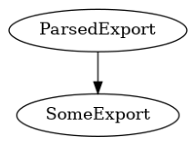

Getting started
---------------

Setting up your working_dir
###########################

First of all we want to introduce our basic idea on how to manage our data in luisy. Usually we
maintain all data of different projects in one directory (`working_dir`) on our system. Every
project directory, then contains three subfolders called `raw`, `interim` and `final`. This
principle is taken from `Cookiecutter Directory structure
<https://drivendata.github.io/cookiecutter-data-science/#data-is-immutable>`_.

.. epigraph::
   **Data is immutable!**
   Don't ever edit your raw data, especially not manually, and especially not in Excel. Don't
   overwrite your raw data. Don't save multiple versions of the raw data. Treat the data (and its
   format) as immutable. The code you write should move the raw data through a pipeline to your
   final analysis. You shouldn't have to run all of the steps every time you want to make a new
   figure, but anyone should be able to reproduce the final results with only the code in your
   git repository and the data in `<working_dir>/project_x/raw`.

.. raw:: html

   <pre style="border:1px solid #ccc; background-color: #fcfdff">

   └── &lt;working_dir&gt;
       ├── project_a
       |   ├── final    <--- final data e.g. models, datasets
       |   ├── interim  <--- processed raw data e.g. parsed data in pkl format
       |   └── raw      <--- raw dumped data (immutable)
       |
       └── project_b
           ├── final
           ├── interim
           └── raw
   </pre>

To get any pipeline running, we need to tell our system where our `working_dir` is
located. We recommend to set your working directory inside the environment variable
`WORKING_DIR`, which is used by luisy. Alternatively, you can pass the `working_dir` as a
parameter in the luisy call.

.. code-block:: bash

   export WORKING_DIR=/path/to/my/data/dir

Running a basic pipeline in luisy
#################################

As you probably already know, luisy is a framework built on :py:mod:`luigi`. The goal of both of
these frameworks is to build pipelines which process your data having atomic operations separate
in each task.
This is how a basic pipeline is built with :py:mod:`~luisy` :

.. code-block:: python

   import luisy

    @luisy.raw
    @luisy.xlsx_output(sheet_name='sheet_to_parse')
    # data dump: <working_dir>/raw/some_raw_export.xlsx
    class SomeExport(luisy.ExternalTask):

        def get_file_name(self):
            return "some_raw_export"

   @luisy.requires(SomeExport, as_dict=True) # Input for the task ParsedExport
   @luisy.interim # Subdirectory in our working_dir (raw, interim or final)
   @luisy.auto_filename # Create an automatic filename
   @luisy.pickle_output # Output of path is python pickle
   class ParsedExport(luisy.Task):

       def run(self):
           """
           Logic of our task
           """
           df_export = self.input()['SomeExport'].read() # Read Task out of requires
           self.logger.info('Lets do some magic')
           # Do something awesome transformations on your data
           self.write(df) # Save task as pickle into interim subdir

After inserting the required files in our raw directory, we start the luigi scheduler by using:

.. code-block:: bash

   luigid --background --logdir ~/logs/luigi-server/ --address=0.0.0.0 --port=8082

When the luigi scheduler is running we can now use the luisy command to execute our pipeline

.. code-block:: bash

   luisy --module [project_name].[module] ParsedExport (--working_dir=/path/to/my/data/dir)

Using the central scheduler, luigi offers an interface where you can see an overview of the tasks
you're currently running in your pipeline:

There is also an option to run luigi on a local scheduler. If no browser user interface is needed
for the executed pipeline this can be used by:

.. code-block:: bash

   luisy --module [project_name].[module] ParsedExport (--working_dir=/path/to/my/data/dir)
    --local-scheduler

The output of `ParsedExport` is automatically stored as a pickle file in the `interim`
directory of your working directory. Its filename is automatically generated by attaching the
:py:func:`~luisy.decorators.auto_filename` decorator. If you wish to have your own filename, just
overwrite the method :py:func:`get_file_name` in your :py:class:`~luisy.tasks.base.Task`.

Read output of executed pipeline
################################

We can now load the output of the pipeline above by running the following lines of code:

.. code-block:: python

   import luisy
   from project_name.module import ParsedExport

   # if env variable not set
   luisy.set_working_dir('my_working_dir')

   df = ParsedExport().read()

The tree built in this pipeline can be plotted as well:

.. code-block:: python

   ParsedExport().visualize()

